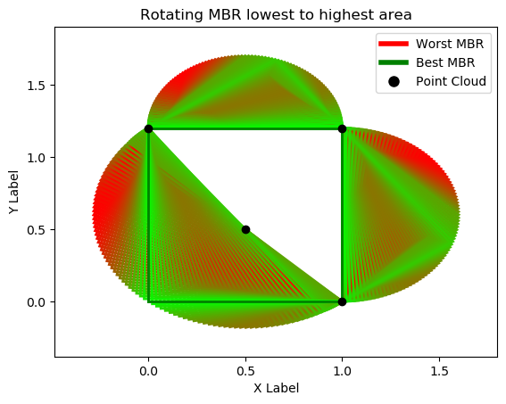

# Rotating Minimum Bounding Rectangle

This is a simple python implementation of the rotating minimum bounding rectangle algorithm with cloud points (3d arrays) without handling 'z' dimension. It also provide a simple visualization of the algorithm with a red to green gradient to represent the best to worst fit.


## Usage

```python
import RotatingMbr

cloud = [
    [0, 1.2, 0],
    [1, 1.2, 0],
    [1, 0, 0],
    [.5, .5, 0],
]
rmbr = RotatingMbr.RotatingMbr(cloud)
print(rmbr.bestMbrPoints)

rmbr.show()
``` 

```python
[array([0., 0., 0.]), array([1., 0., 0.]), array([1. , 1.2, 0. ]), array([0. , 1.2, 0. ])]
```


## Installation

```bash
git clone git@github.com:ColinHmrl/rotating_mbr.git
cd rotating_mbr
pip install -r requirements.txt
pip install -e .
```


## Uninstall 

```bash
pip uninstall rotating-mbr
``` 
